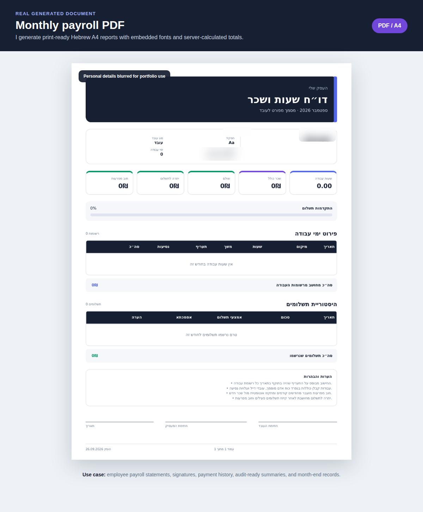
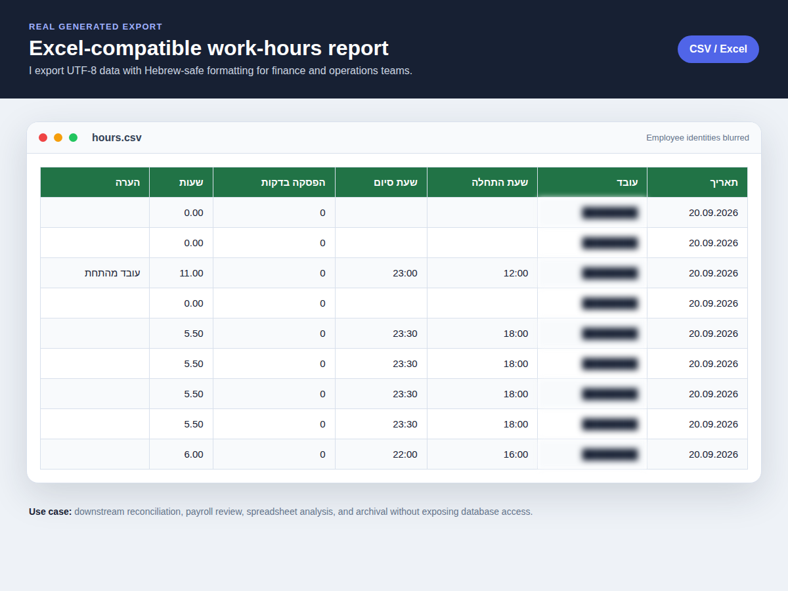

# Customer workforce, payroll and business-finance platform

I built this full-stack workforce management platform for a **real customer** who needed one reliable place to manage employees, work hours, payroll, salary advances, payments, income, expenses and financial reporting. The customer and product identity are intentionally anonymized in this public portfolio.

The interface is designed in Hebrew with full RTL support, while the application logic is enforced on the server. My goal was not only to build attractive dashboards, but to handle the difficult parts of a payroll product: historical rates, permissions, financial traceability, month locking, accurate decimal calculations and exportable records.

> Portfolio privacy note: the screenshots were captured from a local demo environment. Employee names, phone numbers, email addresses, usernames and other identifying fields are blurred.

## What this project demonstrates

- Full-stack product development with **Next.js 16, React 19 and TypeScript**
- Relational data modelling with **PostgreSQL and Prisma**
- Server-side payroll and financial calculations using decimal-safe money values
- Role-based access for administrators, managers and employees
- Secure session authentication, password workflows and request validation
- Hebrew RTL product design with responsive light and dark themes
- Printable A4 payroll PDFs with embedded Hebrew fonts
- Excel-compatible UTF-8 exports for operational and finance teams
- Audit logging, reversal workflows and payroll-period locking
- Containerised deployment with Docker Compose, health checks, migrations and Nginx

## The business problem I designed for

Small and medium-sized companies often split workforce data across spreadsheets, chat messages, paper timesheets and disconnected accounting records. That creates several recurring problems:

- Work hours and salary calculations are easy to mismatch.
- A changed salary rate can accidentally rewrite historical payroll.
- Salary advances and partial payments are difficult to reconcile.
- Employees may see information that should only be available to management.
- Corrections can erase the original financial history.
- Month-end reports require repeated manual spreadsheet work.

I designed the platform around those problems and the customer’s operational workflows. Each feature shares the same employee, work-entry, payroll and finance data, while permissions and calculations remain centralised on the server.

## Product walkthrough

### 1. Secure sign-in and role-aware access


I implemented a secure login flow that accepts a username or email address. Sessions are stored server-side, while the browser receives an HttpOnly cookie. Passwords are hashed with bcrypt, login attempts are rate-limited, and state-changing requests are protected with origin checks.

After authentication, the server resolves the account role:

- **Administrator:** full access to employees, hours, payroll, advances, reports, audit history and settings.
- **Manager:** operational access according to the management permission boundary.
- **Employee:** access only to personal hours, payroll and reports.

The employee restriction is enforced in API and server logic, not merely by hiding navigation links.

### 2. Management dashboard


I use the dashboard to turn operational data into a quick monthly overview. It brings together employee counts, calculated salary, recorded payments, outstanding balances and salary-advance debt. Quick actions take the administrator directly into the most frequent workflows.

**Typical use case:** the customer opens the platform at the end of the week and immediately sees how much salary has accumulated, what has already been paid and what is still outstanding.

### 3. Employee lifecycle and salary-rate history


The employee directory supports searching, filtering, activation status and account controls. An administrator can create an employee, maintain employment information, deactivate access and reset a temporary password.


I model salary changes as dated history rather than a single editable number. When a new hourly or daily rate becomes effective, the previous rate remains available for older work entries.

**Why this matters:** if an employee receives a raise in September, an August report must still use the August rate. During payroll calculation, the server selects the most recent rate whose effective date is on or before each work date.

### 4. Work-hours management


The hours module supports several real operational scenarios:

- Start/end time with break deduction
- Manual work-entry creation and correction
- Group shifts for several employees
- Monthly filtering and employee-level summaries
- Imported work evidence
- Hourly or daily payment modes
- Per-entry hourly-rate overrides
- Locations, notes and travel amounts
- Contractor-specific attendance and workforce costs

The server validates times and calculates worked minutes. Payroll does not trust a total typed by the browser.

**Typical use case:** a supervisor records one group shift for the team, while payroll staff later expand an employee to review the exact entries and calculated totals.

### 5. Payroll calculation and payments


The payroll view combines work entries, effective salary rates, payments and advances for a selected month. It shows hours, gross salary, money already paid, prior debt and the remaining balance.

The core calculation runs on the server:

```text
For each work entry:
  resolve the salary rate effective on the work date
  calculate hourly or daily base pay
  add contractor workforce components when applicable
  add travel amounts

Gross salary = sum of calculated work-entry values
Outstanding balance = gross salary - active payments - applicable advance debt
```

Money is stored as `NUMERIC(12,2)` and calculated with decimal arithmetic rather than floating-point values. This avoids common currency errors.

I also prevent historical financial corrections from silently disappearing. A wrong payment is reversed with a reason; the original record remains available for audit. When configured, a salary payment creates its linked business expense exactly once, and reversing the payment also reverses that expense.

### 6. Salary advances and debt allocation


An advance is not treated as an unrelated note. I store it as a financial event associated with an employee and payroll period, then carry the remaining debt into payroll calculations.

This makes several cases visible:

- The amount originally advanced
- The employee who received it
- The manager who recorded it
- How much has already been recovered
- The balance still owed
- The payroll month against which repayment is allocated

**Typical use case:** an employee receives an advance during the month. When payroll is prepared, the system calculates the salary and shows the debt impact without requiring a separate spreadsheet.

### 7. Reports and exports


The reporting area separates human-readable documents from data exports. Administrators can generate a detailed payroll PDF or export hours, payments, income and expenses as UTF-8 CSV files that open directly in Excel.

#### Generated payroll PDF



This is a preview of a real PDF generated by the application. I built the document with `@react-pdf/renderer`, A4 layout rules and embedded fonts so Hebrew renders reliably across viewers.

The PDF can include:

- Employee and employment information
- Hours and work-day details
- The rate used for each calculation
- Contractor and travel components
- Gross salary, payments, advances and outstanding balance
- Payment history, notes, signatures and page numbering

The values are produced from the same server-side payroll query used by the application, which reduces the risk of the UI and exported report disagreeing.

#### Excel-compatible export



This preview is based on a real generated `hours.csv` export. I prepend a UTF-8 BOM and quote fields correctly so Hebrew text and commas are handled when the file is opened in Excel.

**Typical use cases:** external reconciliation, spreadsheet analysis, accountant handoff, archival and custom reporting without direct database access.

### 8. Audit trail


I added an audit trail for actions where accountability matters: login, logout, creation, updates, account status changes, salary-rate changes, payments, reversals, payroll locking, reopening and report generation.

The log helps answer practical questions such as “who changed this rate?”, “when was this payment reversed?” and “who reopened the month?” without storing passwords, session tokens or other secrets.

### 9. Business settings and administration


The settings area centralises company details and operational defaults. It includes business information, localisation, PDF footer text, financial categories, manager accounts and password management.

Financial categories let the same system track income, payroll expenses and operating expenses. The finance layer calculates cash flow and profit from active—not reversed—transactions.

### 10. Employee self-service experience


I created a reduced employee experience instead of exposing the management interface. The dashboard shows only the signed-in employee’s own work and payroll summary.


Employees can review their attendance for the selected month and use the work controls allowed by the organisation.


The personal payroll page explains calculated earnings, recorded payments, advance debt and the remaining balance.


Employees can generate their own payroll report, while server-side authorization prevents them from requesting another employee’s document by changing an ID or URL.

## Important engineering decisions

| Concern | My implementation | Reason |
|---|---|---|
| Payroll accuracy | Server-side calculation with decimal money values | The browser is not trusted as the source of financial totals. |
| Historical salary | Effective-dated rate records | A future raise does not change an older payroll period. |
| Authorization | Role checks plus employee ownership checks | UI visibility alone is not a security boundary. |
| Financial corrections | Reversal records with reasons | History remains traceable instead of being deleted. |
| Closed payroll | Explicit month locking and reopening | Prevents accidental changes after payroll approval. |
| Reporting | Shared server query for UI and PDF | Reduces inconsistent totals between screens and documents. |
| Hebrew documents | Embedded OpenType fonts | PDF output remains portable and readable. |
| Spreadsheet exports | UTF-8 BOM and escaped CSV fields | Hebrew data opens correctly in Excel. |
| Deployment | Docker Compose, migrations, health checks and Nginx | Creates a repeatable operational setup. |

## Architecture

```text
Next.js App Router UI
        │
        ├── Server Components and protected layouts
        ├── Route Handlers with authentication and validation
        │
        ▼
Domain services
  payroll · finance · advances · periods · work entries
        │
        ▼
Prisma ORM
        │
        ▼
PostgreSQL
```

I keep business calculations in service modules rather than React components. Route handlers authenticate the request and validate input, services implement the domain rules, and Prisma persists relational data. This separation makes sensitive rules reusable by pages, APIs, tests and report generation.

## Reliability and security work

- Database-backed sessions with random tokens stored as SHA-256 hashes
- HttpOnly cookies, `SameSite=Lax`, and secure cookies in production
- bcrypt password hashing and temporary-password flows
- Login rate limiting and same-origin checks for mutations
- Zod validation at API boundaries
- Security headers and restricted browser permissions
- Server-enforced role and employee ownership checks
- Audit entries that exclude secrets and credentials
- Payroll-period locks and explicit reopening
- Reversal-based financial history
- PostgreSQL backup and restore scripts
- Automated tests for payroll, finance, advances, authorization, PDFs and work-hour rules

## Technology stack

- **Frontend:** Next.js 16, React 19, TypeScript, Tailwind CSS, Recharts, Lucide
- **Backend:** Next.js Route Handlers and server-side service modules
- **Database:** PostgreSQL 17, Prisma ORM and versioned migrations
- **Validation and security:** Zod, bcryptjs, signed/session-token utilities and rate limiting
- **Documents:** `@react-pdf/renderer`, embedded Hebrew fonts and UTF-8 CSV exports
- **Testing:** Vitest and Testing Library
- **Deployment:** Docker, Docker Compose, Nginx and health checks

## What I focused on as a developer

This project gave me the opportunity to work across product design, backend rules, relational modelling, security, document generation and deployment. The most important part for me was treating payroll as a domain with history and accountability—not as a simple CRUD dashboard.

The result is a complete application where the visible interface, financial calculations, permissions, exports and audit history are connected through the same underlying business rules.
