# Ovedly — visual user guide

This guide uses a local demo environment. Names, phone numbers, email addresses, usernames, employee selectors, and other identifying fields are blurred in the screenshots.

## Sign in

Enter a username or email and password. Ovedly automatically opens the workspace allowed for that account's role.

## Administrator guide

### Dashboard

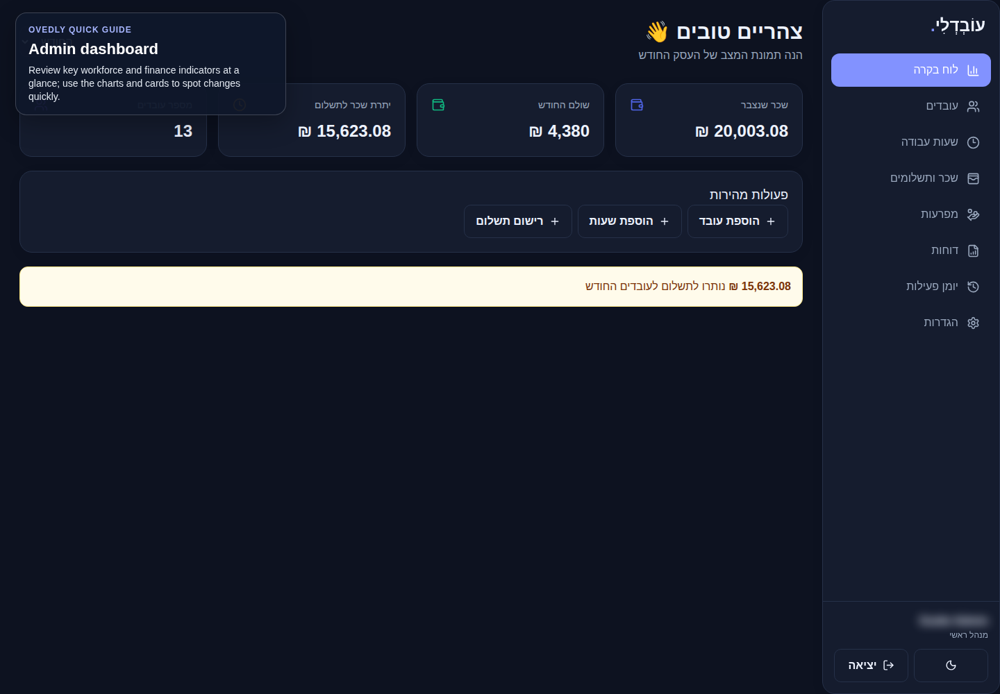

Use the summary cards to review payroll and staffing totals. The quick actions open the most common employee, hours, and payment workflows.

### Employees

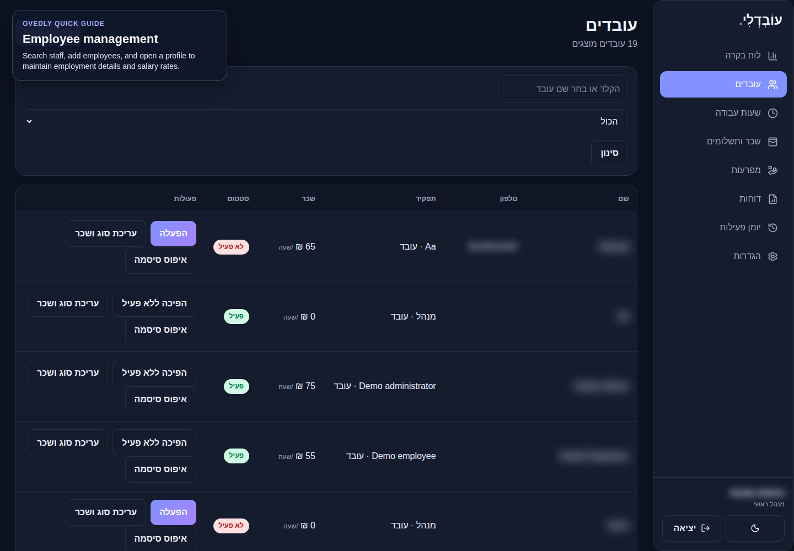

Search or filter the employee list. Open an employee to edit employment details, change status, maintain salary rates, or reset access.

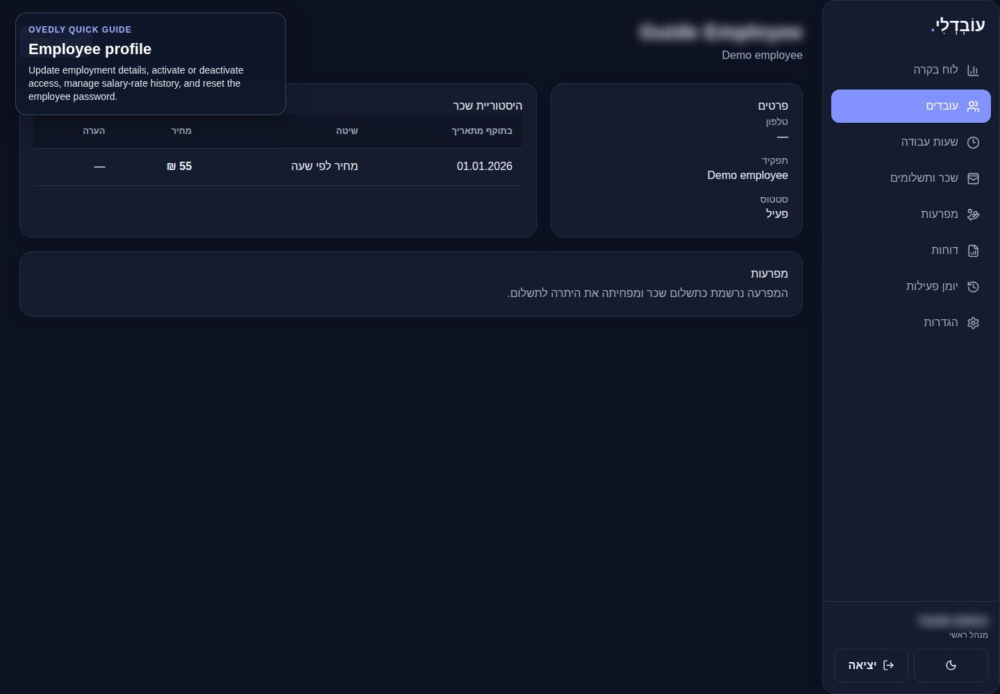

The profile keeps salary-rate history and employee-specific controls together. Add a new dated rate instead of overwriting historical pay data.

### Work hours

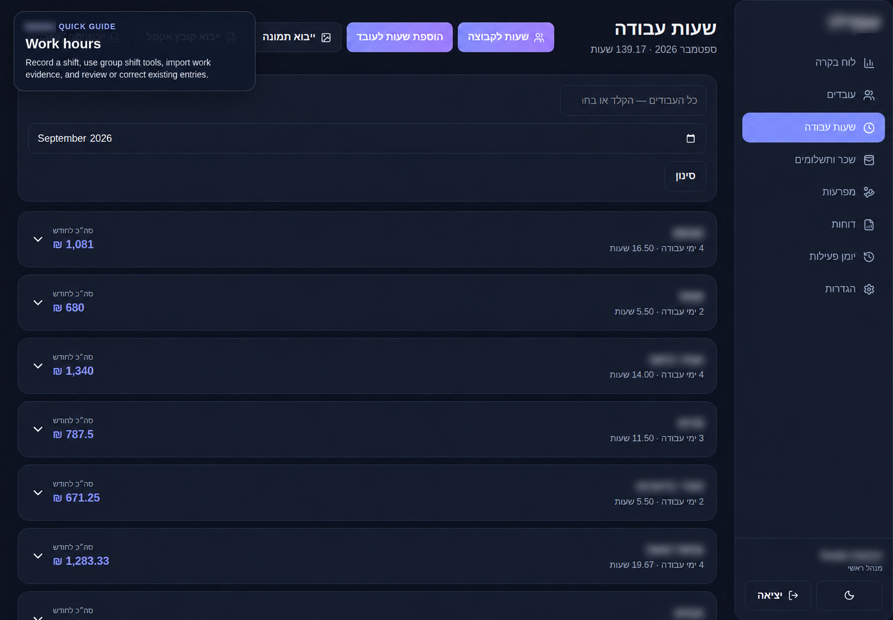

Choose the month, then expand an employee to review entries. The top actions add one shift, create a group shift, or import supporting work data.

### Payroll and payments

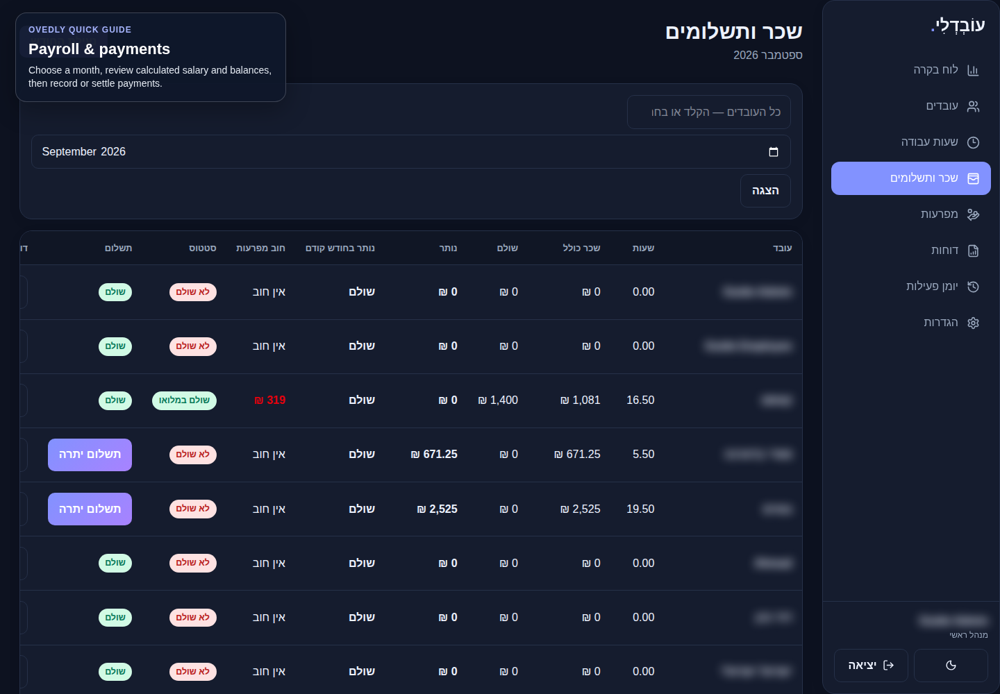

Choose a month to review calculated hours, gross salary, paid amounts, advances, and balances. Use the payment action only after checking the employee row.

### Advances

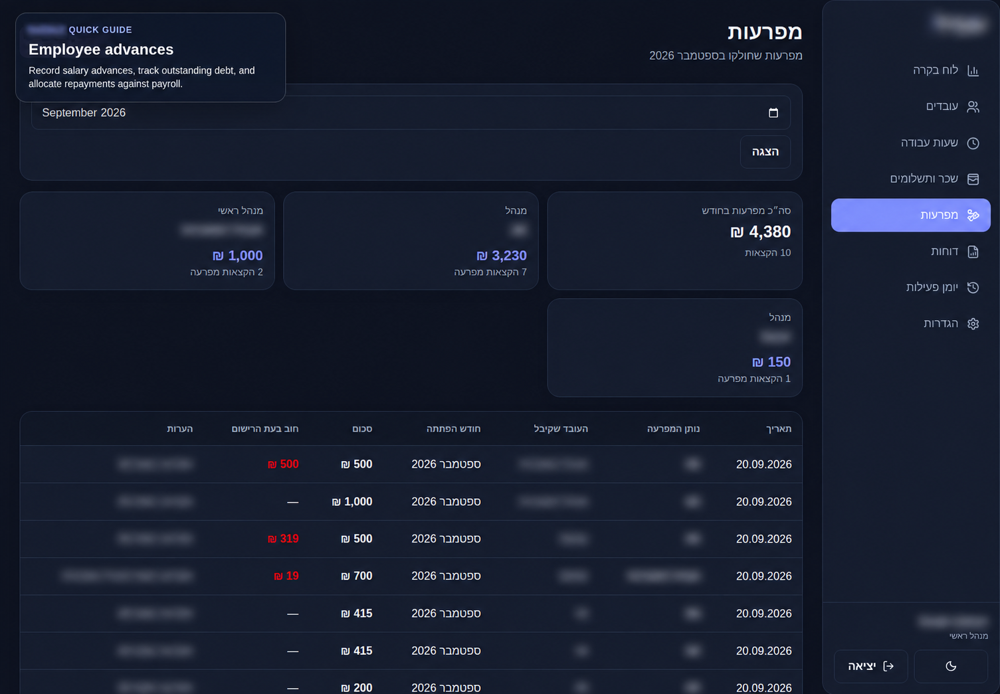

Record advances and review outstanding debt. Repayment allocation is reflected in payroll so the remaining balance stays traceable.

### Reports

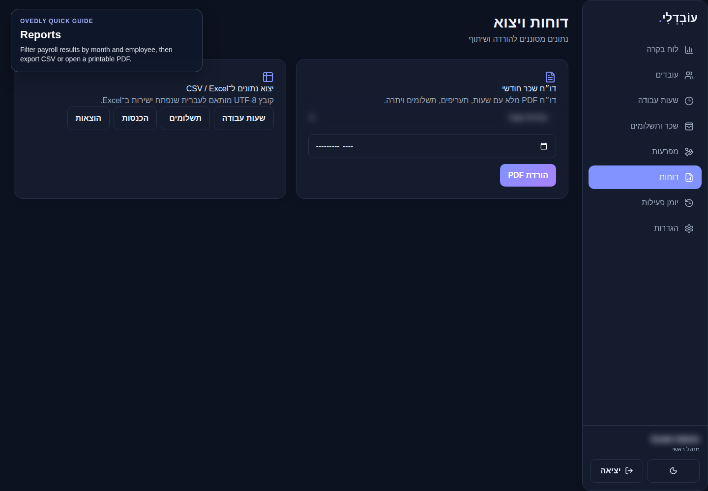

Filter by month and employee. Export CSV for spreadsheet work or generate the printable payroll PDF.

### Activity log

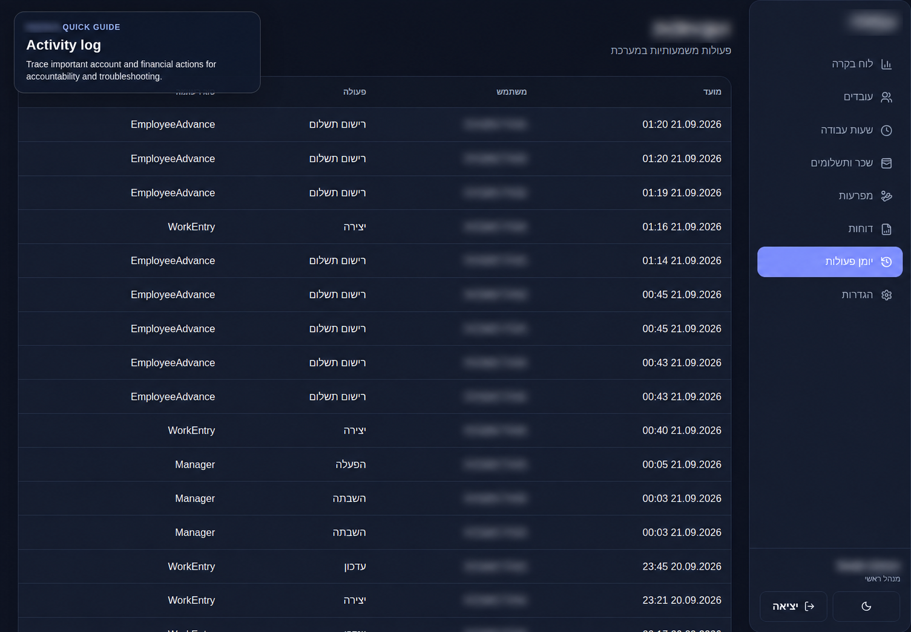

Use the audit log to trace important account, payroll, export, lock, and reversal actions.

### Settings

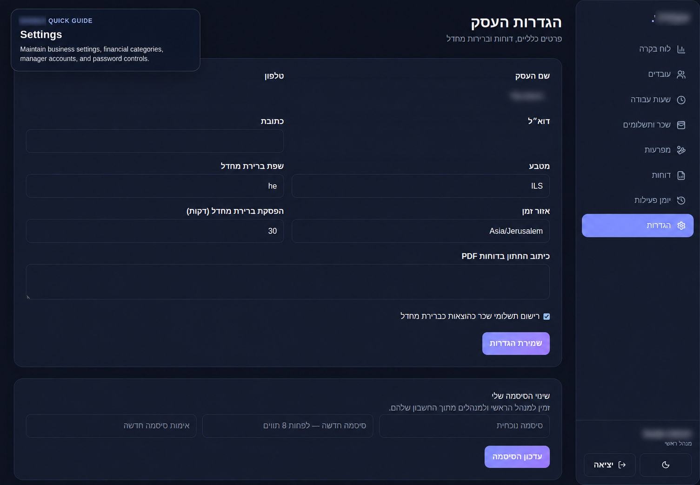

Maintain company defaults, PDF footer text, financial categories, manager accounts, and your password. Save each section after editing it.

## Employee guide

Employees only see their own dashboard, hours, payroll, and reports.

### My dashboard

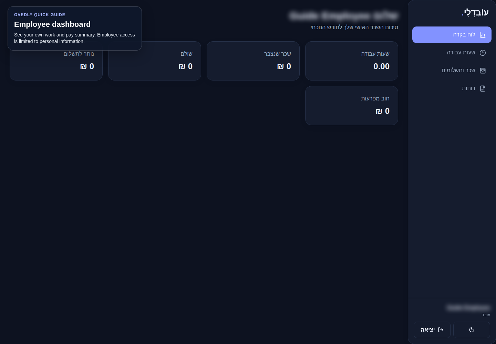

Review your personal work and pay summary. Information belonging to other employees is not available from this role.

### My work hours

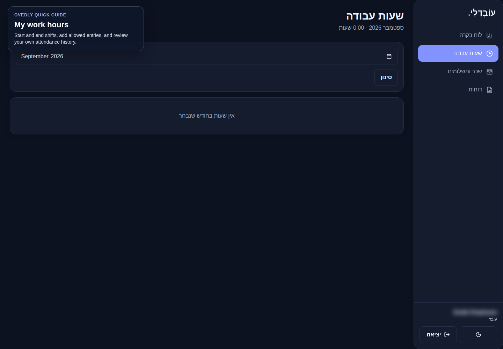

Choose the month to review attendance. Where enabled, use the available shift controls to start, end, or add your own work entry.

### My payroll

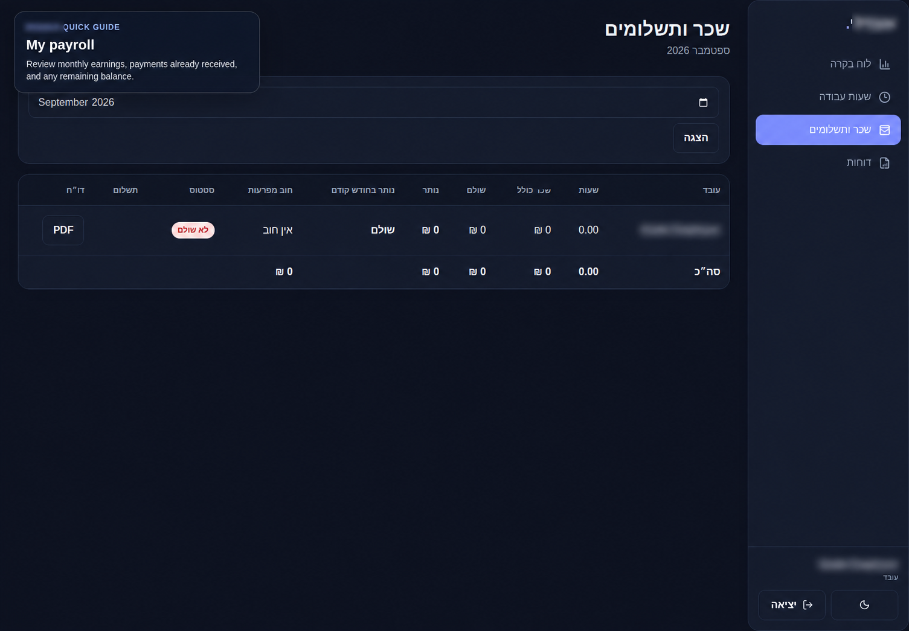

Review monthly earnings, recorded payments, advances, and the remaining balance.

### My reports

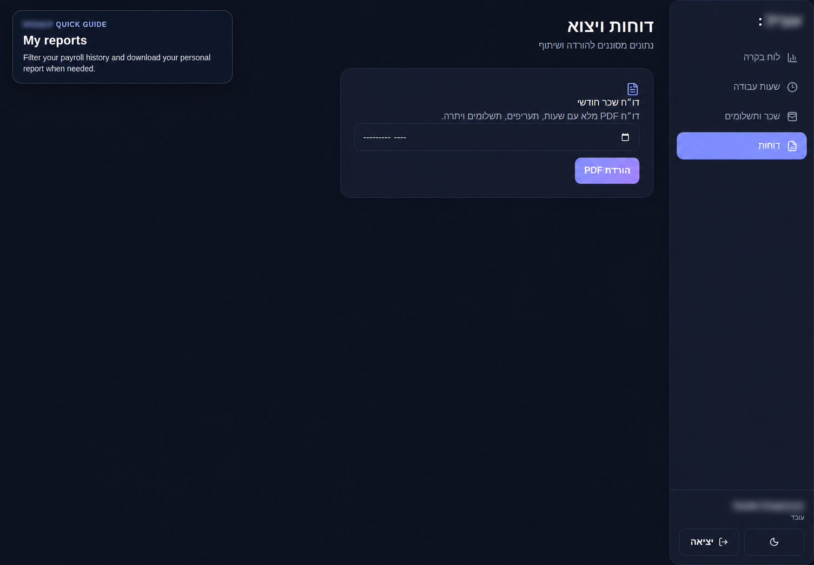

Choose a month and download your personal payroll report when needed.
